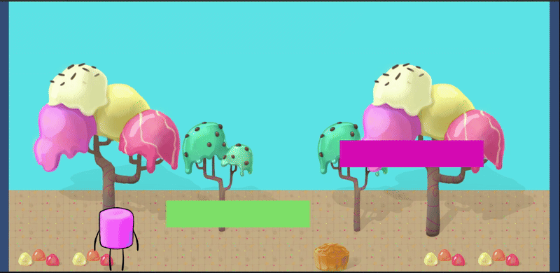
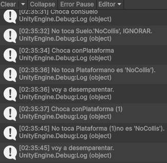

# Introducción a Unity 2D - Mecánicas

## Salto

En esta mecánica se implementó la capacidad del jugador para saltar utilizando el componente Rigidbody2D y las físicas del motor. Se aplicó una fuerza vertical hacia arriba cuando el usuario presiona la tecla configurada para el salto (Input.GetButtonDown("Jump")). Además, se controló que el jugador sólo pueda saltar cuando está en el suelo mediante una variable booleana (isJumping). Esta bandera se activa al saltar y se desactiva al detectar una colisión con el suelo o una plataforma, permitiendo así evitar saltos múltiples en el aire.

## Salto a una plataforma

Para el salto sobre plataformas móviles, se utilizó la detección de colisiones con objetos etiquetados como Plataforma. Cuando el jugador colisiona con una de ellas, se convierte en hijo de la plataforma mediante transform.SetParent(other.transform). Esto permite que el jugador se mueva junto con la plataforma. Al abandonar la plataforma, se ejecuta el evento OnCollisionExit2D, donde se restaura el estado original del jugador, desvinculándolo de la plataforma con transform.SetParent(null).

## Manejo de colisiones por capa

Se implementó una lógica que permite discriminar las colisiones según la capa del objeto. Mediante el uso de LayerMask.NameToLayer("NoCollis"), se ignoran las colisiones con objetos pertenecientes a esa capa, lo que permite un mayor control sobre qué elementos afectan físicamente al jugador. Este filtrado facilita la implementación de comportamientos específicos y evita interacciones innecesarias entre objetos.

## Plataformas invisibles que se vuelven visibles

Se desarrolló una mecánica para plataformas invisibles que se vuelven visibles al contacto con el jugador. Se detecta la colisión con objetos en la capa PlatInv y, en ese momento, se accede al componente SpriteRenderer de la plataforma para habilitar su visibilidad (sr.enabled = true). De esta forma, las plataformas ocultas aparecen en el momento adecuado, añadiendo una capa de sorpresa o desafío al nivel.

## Mecánica de recolección

Se creó una mecánica de recolección de objetos, como monedas, que otorgan puntos al jugador al ser tocadas. Al colisionar con un objeto con la etiqueta Player, el script del objeto recolectable (Moneda) llama al método AñadirPuntos() del script del jugador. Este método actualiza la puntuación en pantalla y, cuando se alcanza un umbral definido (puntuacionParaMejora), se incrementa la fuerza de salto del jugador (thrust), representando una mejora de habilidad. Finalmente, el objeto recolectado se destruye para no volver a usarse.

